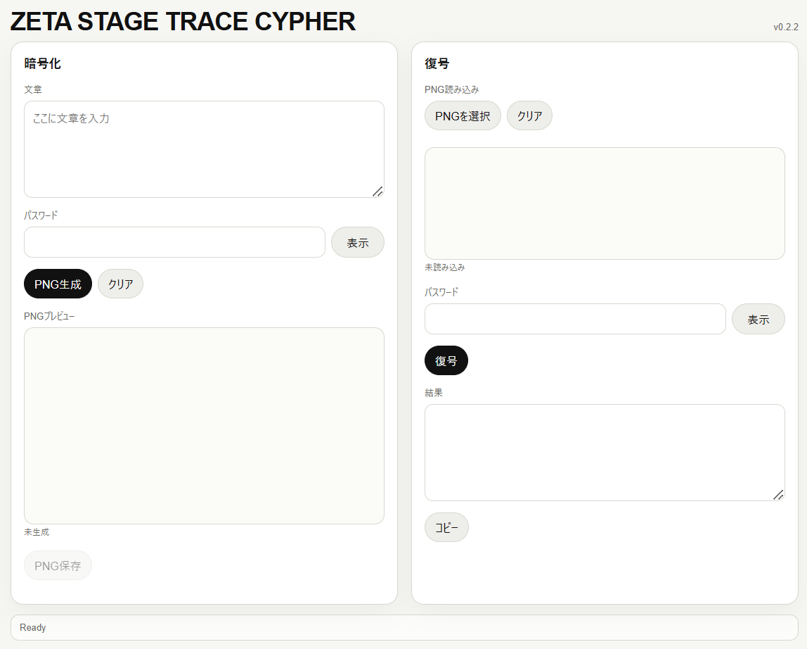

# ZETA STAGE TRACE CYPHER



**ZETA STAGE TRACE CYPHER** is an experimental PNG visual cipher.
It transforms a text message into a single-line encrypted trace and restores the message from the original PNG with the correct password.

Unlike earlier ZETA-based experiments that read from a fixed stored digit table, this app samples decimal windows that appear during the calculation process of ζ(2):

```text
ζ(2) = 1/1² + 1/2² + 1/3² + ...
```

The password does not simply “open” the message.
It determines a multilayer route through intermediate calculation stages and arbitrary decimal positions.
Those sampled decimal windows are folded into a deterministic keystream, and the encrypted result is stored as a PNG trace.

> The message becomes an unreadable trace.
> The password becomes a coordinate system for reading a ZETA calculation field.

---

## Concept

ZETA STAGE TRACE CYPHER is built around one idea:

**Information is not placed on top of an image.
It appears through a password-dependent reading of a mathematical calculation process.**

The app uses the intermediate partial sums of ζ(2):

```text
Sₙ = 1/1² + 1/2² + ... + 1/n²
```

For each encrypted byte, the app derives several sampling points from the password and salt.
Each sampling point selects:

* a calculation stage `n`
* a decimal position after the point
* a small local decimal window
* additional mixing values derived from the password route

These decimal windows are calculated locally and folded into the keystream.
The final encrypted payload is then encoded into a PNG as a continuous visual trace.

The result is not just an encrypted file.
It is an encrypted handwriting-like residue of a calculation route.

---

## What makes this different

Most visual encryption tools follow this structure:

```text
message → standard encryption → data → image container
```

ZETA STAGE TRACE CYPHER instead follows this conceptual structure:

```text
message + password
↓
password-derived route
↓
intermediate ζ(2) calculation stages
↓
arbitrary decimal windows
↓
ZETA stage keystream
↓
PNG trace
```

The PNG is not just decoration.
It is the visible carrier of the encrypted trace.

The app does **not** use a stored table of completed ZETA digits.
It computes local decimal windows from intermediate partial sums as needed.

---

## Main features

* Text-to-PNG visual encryption
* PNG-to-text restoration with the correct password
* Single-line trace style output
* Password-derived ZETA stage route
* No fixed ZETA digit table
* Local decimal window calculation from intermediate ζ(2) partial sums
* PBKDF2-SHA-256 key derivation
* HMAC-assisted route and authentication structure
* 32-byte authentication tag in the v0.2 format
* Support for longer messages; the old 6000 byte artificial text limit has been removed
* v0.1 / v0.2 carrier compatibility for decoding older generated PNGs
* Runs entirely in the browser
* No server-side processing
* No account, database, or upload required

---

## Usage

### Encrypt

1. Open the app in a browser.
2. Enter a message.
3. Enter a password.
4. Press **PNG生成**.
5. Save the generated PNG.

The PNG contains the encrypted trace.
The original message is not readable without the correct password.

### Decrypt

1. Open the app.
2. Load the PNG.
3. Enter the same password.
4. Press **復号**.
5. The original text is restored if the password and PNG are valid.

---

## Recommended image handling

For best results, use the original generated PNG.

Light re-saving or slight resizing may still decode, but this is not the preferred workflow.
Strong compression, screenshots, rotation, cropping, heavy scaling, and social media recompression can damage the carrier.

Recommended:

* Keep the original PNG
* Avoid screenshots when possible
* Avoid cropping
* Avoid rotation
* Avoid heavy compression
* Avoid sending through services that recompress images aggressively

---

## Security position

ZETA STAGE TRACE CYPHER is an experimental visual cipher.
It is designed for poetic, personal, visual, and conceptual secrecy.

It is **not** a formally audited cryptographic system.
Do not use it as the only protection for high-value secrets such as:

* financial credentials
* identity documents
* business secrets
* private keys
* medical or legal records
* passwords for important accounts

The app is intentionally honest about its position:

```text
Experimental visual cipher.
Not a formally audited secure cryptosystem.
```

That said, the v0.2 design is much harder to analyze than a simple fixed-number-table cipher.
The password-derived route, intermediate-stage sampling, local decimal window calculation, HMAC-assisted mixing, and authentication tag all make casual decoding impractical without the password.

The strength still depends heavily on the password.
A long passphrase is strongly recommended.

---

## Deploy to Cloudflare Pages

If the extracted app folder is directly on your Desktop, deploy with:

```powershell
cd "$env:USERPROFILE\Desktop\zeta-stage-trace-cypher-v022"
npx wrangler pages deploy . --project-name zeta-stage-trace-cypher
```

---

## Author

Created by **MASATO NASU**.

This project is part of a continuing series of experimental visual cipher tools exploring the relationship between computation, secrecy, traces, and generated form.
